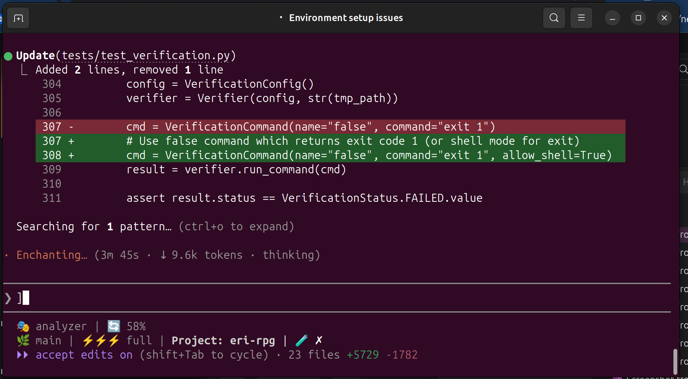

# EriRPG

> *This README was generated by EriRPG. The developer was feeling lazy.* 😏

**Make Claude better at complex code changes.**

EriRPG gives Claude a structured workflow and persistent memory. You talk to Claude, Claude uses EriRPG internally to track specs, remember code, verify changes, and avoid mistakes.

## Why?

Without EriRPG, Claude:
- Re-reads the same files repeatedly (wastes tokens)
- Forgets decisions from earlier in the session
- Makes changes without verifying they work
- Gets confused on multi-step tasks

With EriRPG, Claude:
- Stores knowledge about modules and recalls it instantly
- Tracks decisions and context across sessions
- Verifies changes before marking complete
- Follows a structured workflow: discuss → plan → implement → verify

## Setup (5 minutes)

```bash
# Install
pip install -e /path/to/eri-rpg

# Register your project
eri-rpg add myproject /path/to/project

# Install Claude Code integration
eri-rpg install
```

That's it. Now use Claude Code normally.

## Usage

Talk to Claude using slash commands:

| Command | What it does |
|---------|--------------|
| `/eri:start` | Begin a coding session |
| `/eri:execute "add auth"` | Execute a goal with full workflow |
| `/eri:quick file.py "fix bug"` | Quick single-file edit |
| `/eri:status` | Check current state |
| `/eri:recall auth` | Get Claude's stored knowledge |
| `/eri:resume` | Continue from last session |

### Example

```
You: /eri:start
You: Add retry logic to the API client

Claude: [Internally runs eri-rpg commands to:]
  - Check what it knows about the API client
  - Create a plan
  - Make edits with verification
  - Track the decision for future sessions
```

You describe what you want. Claude handles the workflow.

### Typical Workflow

```
/eri:start myproject           # 1. Start session
/eri:discuss "add auth"        # 2. Clarify requirements
/eri:spec create auth          # 3. Lock down spec
/eri:research auth             # 4. Learn existing code
/eri:plan                      # 5. Create implementation plan
/eri:execute                   # 6. Implement with verification
/eri:done                      # 7. Mark complete
```

Or skip the ceremony for quick fixes:
```
/eri:quick myproject src/utils.py "fix off-by-one"
```

See [docs/TYPICAL_WORKFLOW.md](docs/TYPICAL_WORKFLOW.md) for details.

## Tiers

| Tier | What Claude can do |
|------|-------------------|
| **lite** | Quick fixes, search, cross-project queries |
| **standard** | + Discussion mode, goal clarification |
| **full** | + Full agent runs, specs, verification |

Default is `lite`. Upgrade with: `eri-rpg mode myproject --standard`

## Project Management

These are the only CLI commands you need to run directly:

```bash
eri-rpg add <name> <path>    # Register a project
eri-rpg remove <name>        # Unregister
eri-rpg list                 # Show registered projects
eri-rpg install              # Set up Claude Code hooks
eri-rpg install-status       # Check installation
```

Everything else? Claude handles it.

## Status Line

EriRPG adds a status line to Claude Code showing current context:



- **Persona** - Auto-detected from tool usage (analyzer, backend, frontend, etc.)
- **Context %** - How much of the context window is used
- **Branch** - Current git branch
- **Tier** - lite/standard/full (⚡ indicators)
- **Project** - Active EriRPG project

## How It Works

```
┌─────────┐     slash commands      ┌─────────┐
│   You   │ ───────────────────────▶│  Claude │
└─────────┘                         └────┬────┘
                                         │
                                         │ CLI calls
                                         ▼
                                    ┌─────────┐
                                    │ EriRPG  │
                                    │   CLI   │
                                    └────┬────┘
                                         │
                    ┌────────────────────┼────────────────────┐
                    ▼                    ▼                    ▼
              ┌──────────┐        ┌──────────┐        ┌──────────┐
              │ Knowledge│        │  Specs   │        │  Verify  │
              │  Graph   │        │ & Plans  │        │  Tests   │
              └──────────┘        └──────────┘        └──────────┘
```

EriRPG stores:
- **Knowledge graph** - What Claude learned about your code
- **Specs & plans** - Goals broken into steps
- **Decisions** - Why Claude made certain choices
- **Run state** - Progress on multi-step tasks

This persists across sessions. Claude resumes where it left off.

## Language Support

| Language | Support |
|----------|---------|
| Python | Full (AST-based) |
| Rust | Basic (regex) |
| C/C++ | Basic (regex) |
| Dart | Full (regex) |

## Requirements

- Python 3.10+
- Claude Code (CLI)

## Documentation

- [docs/MANUAL.md](docs/MANUAL.md) - Complete reference
- [DESIGN.md](DESIGN.md) - Technical architecture

## Empowerment Directive

EriRPG includes [EMPOWERMENT.md](EMPOWERMENT.md) - a mandatory behavior directive based on research showing AI assistants can inadvertently undermine user autonomy and skill development.

**The core principle:** Make the developer better, not unnecessary.

This means Claude will:
- **Challenge before compliance** - Push back on bad ideas before implementing
- **Require intent** - Ask "why" before blindly executing "what"
- **Flag autonomy transfers** - Enumerate significant decisions before making them
- **Preserve skills** - Explain reasoning so you can do it yourself next time
- **No sycophancy** - Honest feedback over empty validation

Based on: [Who's in Charge? Disempowerment Patterns in Real-World LLM Usage](https://arxiv.org/abs/2601.19062) (Sharma et al., 2026)

> "Interactions with greater disempowerment potential receive higher user approval ratings, possibly suggesting a tension between short-term user preferences and long-term human empowerment."

EriRPG optimizes for your growth, not your approval.

## Status

Alpha v0.57 - usable but evolving.

### Working
- ✅ Knowledge storage and recall
- ✅ Cross-project search (<1ms queries)
- ✅ Quick fix mode
- ✅ Discussion mode
- ✅ Run tracking with decisions
- ✅ Claude Code hooks
- ✅ Session context persistence (SQLite)
- ✅ Automatic git branch tracking

### In Progress
- ⚠️ Multi-agent parallel execution
- ⚠️ Transplant mode (copy features between projects)

## License

MIT
