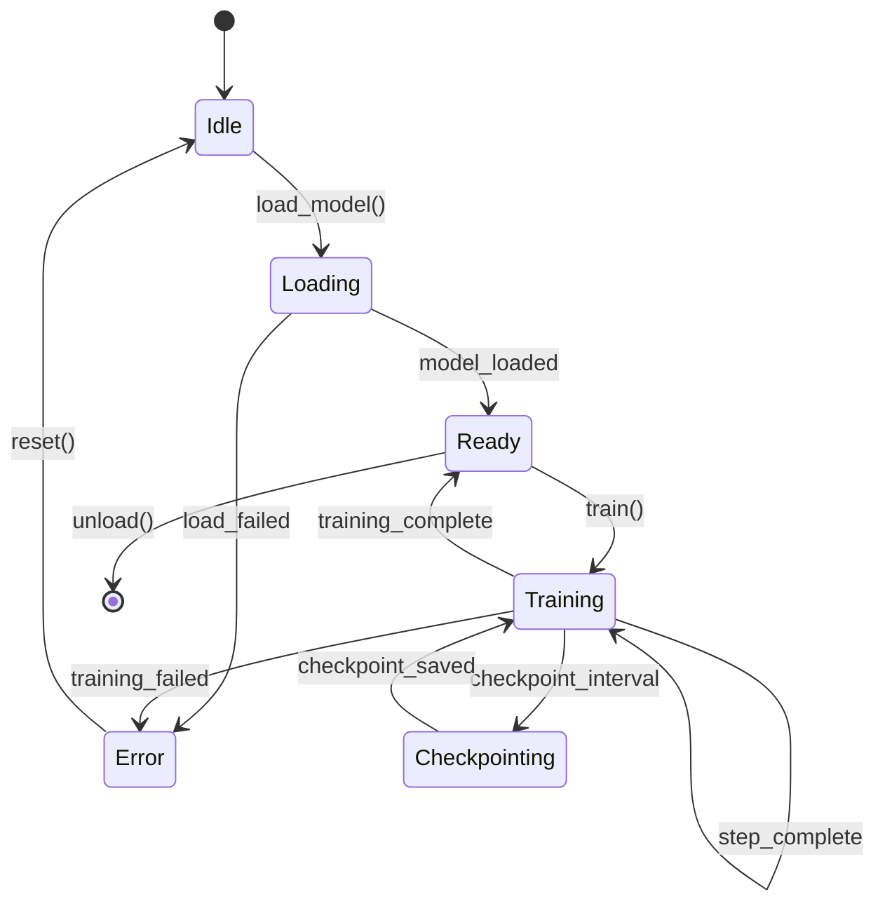

# Blueprint & Behavior System

Complete reference for documenting programs and porting features across languages.

## Overview

The Blueprint & Behavior system solves a critical problem: **How do you port features between codebases with different languages, patterns, and conventions?**

The answer: Extract **WHAT** a feature does (behavior), not **HOW** it's coded. Then implement the behavior in the target's native style.

```
┌─────────────────┐                    ┌─────────────────┐
│  Source Code    │                    │  Target Code    │
│  (Python/PyTorch)│                   │  (Rust/Candle)  │
└────────┬────────┘                    └────────▲────────┘
         │                                      │
         │ extract behavior                     │ implement behavior
         ▼                                      │
    ┌─────────────────────────────────────────────┐
    │           BEHAVIOR.md (Portable)            │
    │  - Interface Contract                       │
    │  - Global State Impact                      │
    │  - Ownership Model                          │
    │  - Resource Budget                          │
    │  - State Machine                            │
    │  - Test Contracts                           │
    └─────────────────────────────────────────────┘
```

---

## Quick Start

### 1. Document Source Feature

```bash
# Create behavior spec from source code
python3 -m erirpg.commands.blueprint add onetrainer models/sana "Sana model training" \
  --path /path/to/onetrainer/models/sana \
  --extract-tests \
  --json
```

This creates:
- `.planning/blueprints/onetrainer/models/sana.md` - Implementation blueprint
- `.planning/blueprints/onetrainer/models/sana-BEHAVIOR.md` - Portable behavior spec

### 2. Run Behavior Extractor Agent

After creating the template, have Claude fill it in:

```
Use Task tool with erirpg/agents/behavior-extractor.md instructions
to analyze the source code and fill in the -BEHAVIOR.md file.
```

### 3. Port Feature to Target

```bash
# Add feature to target using source behavior
python3 -m erirpg.commands.add_feature eritrainer sana "Sana model training" \
  --reference onetrainer/models/sana \
  --json
```

This creates a feature spec with:
- Interface Contract (adapted to target)
- Compatibility checks (ownership, side effects)
- Implementation plan (domain layer + adapters)

### 4. Implement and Verify

```bash
# After implementation, verify against spec
python3 -m erirpg.commands.verify_behavior eritrainer/sana --json
```

---

## Commands Reference

### /coder:blueprint

Manage section-level blueprints of complex programs.

#### Subcommands

| Command | Description |
|---------|-------------|
| `list` | Show all blueprints |
| `add <program> <section> "<desc>"` | Create new blueprint |
| `load <program>/<section>` | Load blueprint content |
| `status <program>` | Show blueprint status |
| `update <program>/<section>` | Update timestamp/status |
| `deps <program>` | View dependency graph |

#### Flags

| Flag | Description |
|------|-------------|
| `--path <path>` | Source code path to analyze |
| `--depends <sections>` | Comma-separated dependencies |
| `--extract-behavior` | Create -BEHAVIOR.md file |
| `--extract-tests` | Also extract test contracts (implies --extract-behavior) |
| `--behavior` | Load only the behavior spec (with `load`) |
| `--status <status>` | Set status: complete, in_progress, not_started, outdated |
| `--json` | Output as JSON |

#### Examples

```bash
# Create program overview
python3 -m erirpg.commands.blueprint add onetrainer overview "High-level architecture" \
  --path /home/alex/onetrainer --json

# Create section with dependencies
python3 -m erirpg.commands.blueprint add onetrainer training-pipeline "Core training loop" \
  --path src/training/ --depends overview --json

# Create section with full behavior extraction
python3 -m erirpg.commands.blueprint add onetrainer models/flux "Flux model" \
  --path src/models/flux/ --extract-tests --json

# Load behavior only (for porting)
python3 -m erirpg.commands.blueprint load onetrainer/models/flux --behavior --json

# Check what's documented
python3 -m erirpg.commands.blueprint status onetrainer --json

# View dependency graph
python3 -m erirpg.commands.blueprint deps onetrainer --json
```

---

### /coder:add-feature

Add a feature to an existing codebase.

#### Modes

**Standard Mode** - Add new feature:
```bash
python3 -m erirpg.commands.add_feature "<description>" --json
```

**Reference Mode** - Port from another program:
```bash
python3 -m erirpg.commands.add_feature <target> <feature> "<desc>" \
  --reference <source>/<section> --json
```

#### What Reference Mode Does

1. **Loads source behavior spec** (what it does)
2. **Loads target conventions** (how target works)
3. **Scans target for interface requirements**:
   - Base traits/interfaces
   - Wrapper types (Arc, Result, etc.)
   - Required decorators
   - Naming conventions
4. **Checks compatibility**:
   - Ownership model compatibility
   - Side effect compatibility
5. **Creates feature spec** with:
   - Interface Contract
   - Global State Impact
   - Ownership Model
   - Resource Budget
   - Compatibility issues (❌/⚠️)
   - Implementation plan

#### Examples

```bash
# Standard: Add new feature
python3 -m erirpg.commands.add_feature "Add user authentication" --json

# Reference: Port feature from source
python3 -m erirpg.commands.add_feature eritrainer sana "Sana model training" \
  --reference onetrainer/models/sana --json
```

---

### /coder:verify-behavior

Verify implementation matches behavior spec.

#### Usage

```bash
python3 -m erirpg.commands.verify_behavior <program>/<feature> --json
```

#### What It Checks

| Category | What's Verified |
|----------|-----------------|
| **Inputs** | Parameter types match spec |
| **Outputs** | Return types match spec |
| **Interface** | Base traits implemented |
| **State Machine** | All states exist, transitions valid |
| **Test Contracts** | Each Given/When/Then has test |
| **Global State** | No forbidden mutations |
| **Ownership** | Borrow/move matches spec |
| **Resources** | (Manual verification flagged) |

#### Status Values

| Status | Meaning |
|--------|---------|
| ✅ | Pass - code matches spec |
| ❌ | Fail - must fix before done |
| ⚠️ | Manual - cannot auto-check |
| ⏳ | Pending - not yet analyzed |

#### Blocking Behavior

If `"blocking": true` in result:
- There are ❌ violations
- Do NOT mark feature complete
- Fix violations first

---

## BEHAVIOR.md Format

The complete portable behavior specification format.

### Header

```yaml
---
program: onetrainer
section: models/sana
type: behavior-spec
portable: true
has_tests: true
created: 2026-01-31
updated: 2026-01-31
---
```

### Sections

#### 1. Purpose

```markdown
## Purpose
<!-- One paragraph, user perspective -->
Trains Sana models using provided datasets and configuration.
User provides training data and config, receives fine-tuned model weights.
```

#### 2. Inputs

```markdown
## Inputs

### Required
- **dataset:** Path to training data directory. Must contain images and captions.
- **model_path:** Path to base Sana model weights (safetensors format).

### Optional
- **config:** Training configuration file. Default: config/default.yaml
- **output_dir:** Where to save results. Default: ./output

### Configuration
- **batch_size:** Training batch size. Range: 1-32. Default: 1
- **learning_rate:** Optimizer LR. Range: 1e-6 to 1e-3. Default: 1e-4
- **gradient_checkpointing:** Trade memory for speed. Default: false
```

#### 3. Outputs

```markdown
## Outputs

### Primary
- Trained model weights (safetensors format) at output_dir/final.safetensors

### Side Effects
- Creates output_dir if not exists
- Writes checkpoints every N steps

### Artifacts
- training.log - Training metrics per step
- checkpoints/*.safetensors - Intermediate checkpoints
- config_used.yaml - Actual config used
```

#### 4. Behavior

```markdown
## Behavior

### Normal Flow
1. User provides dataset path and model path
2. System validates dataset (images + captions exist)
3. System loads base model into GPU memory
4. For each training step:
   - Load batch of images
   - Compute forward pass
   - Calculate loss
   - Update weights
   - Report progress (step N/total, loss value)
5. Save final weights to output directory
6. User receives trained model

### Detailed Steps
<!-- Specific behavior for complex operations -->
```

#### 5. Test Contracts

```markdown
## Test Contracts
<!-- Extracted from source tests -->

| Given | When | Then |
|-------|------|------|
| Empty dataset | train() called | Raises EmptyDataError |
| Invalid model path | load_model() | Raises FileNotFoundError |
| Valid config | training completes | Output exists, loss decreased |
| OOM condition | during step | Checkpoint saved, graceful exit |
| Interrupted | SIGINT received | Current state saved |
```

#### 6. Interface Contract

```markdown
## Interface Contract

### Source Signatures
- **Input type:** torch.Tensor (image), str (caption)
- **Output type:** torch.Tensor (loss)
- **Error handling:** raises Exception with message
- **Required decorators:** @torch.no_grad() for eval

### Target Must Adapt To
<!-- Filled by add-feature after scanning target -->
- **Base trait:** ModelTrait
- **Input wrapper:** Tensor<f32>
- **Output wrapper:** Result<Tensor<f32>, ModelError>
- **Required impl:** fn forward(&self, x: &Tensor) -> Result<Tensor>
```

#### 7. Dependencies

```markdown
## Dependencies

### Hard Dependencies (must exist)
- Tokenizer service - for caption encoding
- Checkpoint storage - for saving progress

### Soft Dependencies (expects interface)
- Logging service - any implementation (console, file, remote)
- Metrics collector - optional, graceful degradation
- Progress reporter - any implementation (tqdm, rich, plain)

### Environment
- GPU with 24GB+ VRAM
- CUDA 12.0+ or ROCm 6.0+
- 32GB system RAM recommended
```

#### 8. Global State Impact

```markdown
## Global State Impact

### Environment Variables
- **Reads:** CUDA_VISIBLE_DEVICES, HF_HOME, TORCH_HOME
- **Writes:** None
- **Modifies:** None

### File System
- **Creates:** output_dir/*, checkpoints/*
- **Locks:** model file during loading
- **Watches:** None

### Processes
- **Spawns:** None
- **Background threads:** 1 (data prefetching)
- **IPC:** None

### Network
- **Outbound:** HuggingFace Hub (if downloading)
- **Listens:** None

### Global Mutations
- **Sets:** torch.backends.cudnn.benchmark = True
- **Thread safety:** NOT thread-safe - single training instance only
```

#### 9. Resource Budget

```markdown
## Resource Budget

### Memory
- **Peak VRAM:** 22GB for batch_size=1
- **System RAM:** 32GB recommended
- **Scales:** +4GB VRAM per batch_size increment

### Time
- **Init:** <30s (model loading)
- **Per step:** ~500ms on RTX 4090
- **Checkpoint:** ~5s

### Tradeoffs
- Can trade memory for speed via gradient_checkpointing
- Can trade quality for speed via mixed precision (fp16/bf16)

### Constraints
- Must not exceed 24GB VRAM for consumer GPU compatibility
- Must checkpoint every 100 steps (crash recovery requirement)
- Must complete init within 60s or report error
```

#### 10. Ownership Model

```markdown
## Ownership Model

### Inputs
| Data | Ownership | Notes |
|------|-----------|-------|
| dataset | Borrow (read-only) | Iterated, not consumed |
| config | Move (consumed) | Merged into internal state |
| model_path | Borrow | Read once at init |

### Internal State
| Data | Lifetime | Cleanup |
|------|----------|---------|
| model_weights | 'static | Explicit unload() required |
| optimizer_state | Tied to training | Dropped after train() |
| cached_tensors | Per-step | Cleared each iteration |

### Outputs
| Data | Ownership | Notes |
|------|-----------|-------|
| trained_model | Move (returned) | Caller owns |
| metrics | Clone | Internal copy retained |
| checkpoints | None (written to disk) | Caller reads from path |

### Rust Translation Hints
- dataset: `&Dataset` or `impl Iterator<Item = Sample>`
- config: `Config` (owned, consumed)
- model_weights: `Arc<RwLock<Weights>>` if shared access needed
- metrics: `impl Clone` or use `Rc<RefCell<Metrics>>`
```

#### 11. State Machine

```markdown
## State Machine



### State Descriptions
| State | Entry Condition | Valid Actions |
|-------|-----------------|---------------|
| Idle | Initial or after reset | load_model() |
| Loading | load_model() called | wait |
| Ready | Model in memory | train(), unload() |
| Training | train() called | pause(), cancel() |
| Checkpointing | Interval reached | wait |
| Error | Any failure | reset(), get_error() |
```

#### 12. Edge Cases

```markdown
## Edge Cases

### Error Conditions
- **Empty dataset:** Raises EmptyDataError with message "No samples found"
- **OOM:** Saves checkpoint, raises OOMError with VRAM usage stats
- **Corrupt model:** Raises ModelLoadError with file path

### Recovery
- Resume from checkpoint: load_checkpoint(path) then continue_training()
- Retry on network failure: automatic 3x retry with exponential backoff

### Limits
- Max batch size: 32 (GPU memory limit)
- Max training steps: 1M (config enforced)
- Max checkpoint size: 50GB
```

---

## File Structure

```
.planning/blueprints/
├── MANIFEST.md                    # Human-readable index
├── onetrainer/
│   ├── _index.json                # Machine-readable metadata
│   ├── overview.md                # High-level architecture
│   ├── training-pipeline.md       # Section blueprint
│   ├── training-pipeline-BEHAVIOR.md  # Behavior spec
│   └── models/
│       ├── flux.md
│       ├── flux-BEHAVIOR.md
│       ├── sana.md
│       └── sana-BEHAVIOR.md
└── eritrainer/
    ├── _index.json
    └── overview.md

.planning/features/
├── eritrainer-sana.md             # Feature spec (from --reference)
└── feature-auth.md                # Standard feature spec
```

---

## Workflows

### Workflow 1: Document Existing Program

```bash
# 1. Create overview
python3 -m erirpg.commands.blueprint add myprogram overview "Architecture" --path /path/to/code

# 2. Run codebase mapper agent to fill it in
# (Task tool with eri-codebase-mapper)

# 3. Add section blueprints
python3 -m erirpg.commands.blueprint add myprogram api "REST API layer" --depends overview

# 4. Check status
python3 -m erirpg.commands.blueprint status myprogram
```

### Workflow 2: Extract Behavior for Porting

```bash
# 1. Create blueprint with behavior extraction
python3 -m erirpg.commands.blueprint add source-program feature "Feature X" \
  --path src/feature --extract-tests

# 2. Run behavior extractor agent
# (Task tool with behavior-extractor.md instructions)

# 3. Verify extraction quality
python3 -m erirpg.commands.blueprint load source-program/feature --behavior
```

### Workflow 3: Port Feature to New Codebase

```bash
# Prerequisites:
# - Source has: source-program/feature-BEHAVIOR.md
# - Target has: target-program/overview.md

# 1. Add feature with reference
python3 -m erirpg.commands.add_feature target-program my-feature "Feature X" \
  --reference source-program/feature

# 2. Review compatibility issues
# - Check for ❌ blockers
# - Note ⚠️ warnings

# 3. Implement (domain layer first, adapters second)

# 4. Verify implementation
python3 -m erirpg.commands.verify_behavior target-program/my-feature

# 5. Fix any ❌ violations, document ⚠️ manual checks
```

### Workflow 4: Update Outdated Blueprint

```bash
# 1. Mark as outdated
python3 -m erirpg.commands.blueprint update myprogram/section --status outdated

# 2. Re-analyze code
# (Task tool with appropriate agent)

# 3. Update the markdown file

# 4. Mark complete
python3 -m erirpg.commands.blueprint update myprogram/section --status complete
```

---

## Agent Instructions

### behavior-extractor.md

The behavior extractor agent extracts portable specs from source code.

**Key Rules:**
- Extract WHAT, not HOW
- No language-specific terms (class, function, module)
- No framework references in behavior (only in dependencies)
- Document ownership semantics for memory-safe targets
- Extract test contracts as Given/When/Then

**12 Extraction Sections:**
1. Purpose
2. Inputs
3. Outputs
4. Behavior
5. Test Contracts
6. Interface Contract
7. Dependencies
8. Global State Impact
9. Resource Budget
10. Ownership Model
11. State Machine
12. Edge Cases

---

## Compatibility Checking

### Ownership Compatibility

When porting to memory-safe languages (Rust, etc.):

| Source Pattern | Issue | Resolution |
|----------------|-------|------------|
| 'static lifetime | Requires explicit cleanup | Add unload() method |
| Move consumed input | Caller can't reuse | Document clearly |
| Shared mutable state | Needs Arc<RwLock> | Add thread safety |

### Side Effect Compatibility

When target forbids global state:

| Source Pattern | Issue | Resolution |
|----------------|-------|------------|
| Global mutations | Forbidden | Encapsulate in struct |
| Env var writes | May be forbidden | Pass config explicitly |
| Not thread-safe | May conflict | Add synchronization |

---

## Best Practices

### DO
- ✅ Extract behavior before implementation details
- ✅ Document ownership semantics for all data
- ✅ Include resource budgets with real numbers
- ✅ Map state machines for complex features
- ✅ Extract test contracts from source tests
- ✅ Verify implementation against spec

### DON'T
- ❌ Copy code between languages
- ❌ Skip compatibility checking
- ❌ Ignore ❌ violations
- ❌ Leave ⚠️ items unverified
- ❌ Mix framework code into domain layer

---

## Troubleshooting

### "No behavior spec found"

Create one:
```bash
python3 -m erirpg.commands.blueprint add program section "desc" --extract-behavior
```

### "No blueprint found for target"

Create target overview:
```bash
python3 -m erirpg.commands.blueprint add target overview "Architecture"
```

### Compatibility check shows ❌ issues

These are blockers. Fix before implementing:
- Ownership issues → Restructure data flow
- Side effect issues → Encapsulate state

### verify-behavior shows ❌ violations

Your code doesn't match the spec. Either:
- Fix the code to match spec, OR
- Update the spec if intentional change

---

## Version History

- **v0.57** - Initial blueprint & behavior system
- **v0.58** - Added interface contract, ownership model, side effect checking
- **v0.59** - Added verify-behavior command
