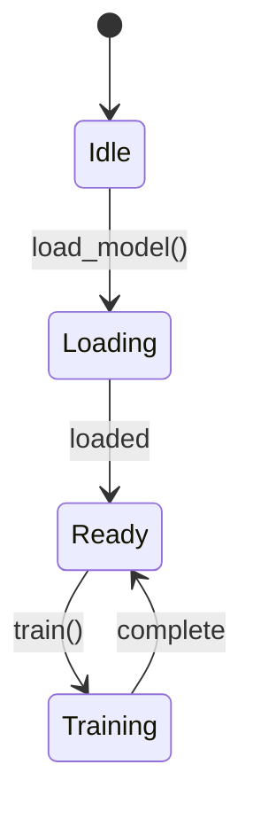

# /coder:blueprint - Section-Level Blueprint Management

Manage section-level blueprints of complex programs. Blueprints provide structured documentation of program architecture that Claude can query and load into context.

## Structure

```
.planning/blueprints/
├── MANIFEST.md              # Human readable index
├── {program}/
│   ├── _index.json          # Machine readable metadata
│   ├── overview.md          # High-level architecture
│   ├── {section}.md         # Section blueprints (HOW - implementation)
│   ├── {section}-BEHAVIOR.md # Behavior specs (WHAT - portable)
│   └── {subsection}/
│       └── {detail}.md      # Nested blueprints
```

## Commands

### List All Blueprints
```bash
python3 -m erirpg.commands.blueprint list --json
```
Shows MANIFEST.md and all programs with section counts.

### Add Blueprint
```bash
# Basic
python3 -m erirpg.commands.blueprint add <program> <section> "<description>" --json

# With source path
python3 -m erirpg.commands.blueprint add <program> <section> "<description>" --path <src-path> --json

# With dependencies
python3 -m erirpg.commands.blueprint add <program> <section> "<description>" --depends overview,core --json

# With behavior extraction (creates BOTH .md and -BEHAVIOR.md)
python3 -m erirpg.commands.blueprint add <program> <section> "<description>" --extract-behavior --json

# With test contract extraction (implies --extract-behavior)
python3 -m erirpg.commands.blueprint add <program> <section> "<description>" --extract-tests --json

# Nested section with full extraction
python3 -m erirpg.commands.blueprint add onetrainer models/flux "Flux model" --path src/models/flux/ --extract-tests --json
```

### Load Blueprint
```bash
# Load full blueprint (implementation details)
python3 -m erirpg.commands.blueprint load <program>/<section> --json

# Load behavior spec only (portable, for porting features)
python3 -m erirpg.commands.blueprint load <program>/<section> --behavior --json
```
Returns blueprint content plus any dependencies. Use `--behavior` when porting to different codebase.

### Check Status
```bash
python3 -m erirpg.commands.blueprint status <program> --json
```
Shows complete/in_progress/not_started sections and suggests next sections to blueprint.

### Update Blueprint
```bash
# Just update timestamp
python3 -m erirpg.commands.blueprint update <program>/<section> --json

# Update status
python3 -m erirpg.commands.blueprint update <program>/<section> --status complete --json
```
Valid statuses: `complete`, `in_progress`, `not_started`, `outdated`

### View Dependencies
```bash
python3 -m erirpg.commands.blueprint deps <program> --json
```
Shows dependency graph and suggested load order.

## BEHAVIOR.md Complete Format

```markdown
# {Section} - Behavior Spec

## Purpose
One paragraph, user perspective.

## Inputs
### Required
- **[name]:** [format, constraints]
### Optional
- **[name]:** [format, default]
### Configuration
- **[name]:** [description, valid values]

## Outputs
### Primary
- [main output]
### Side Effects
- [files, state changes]
### Artifacts
- [logs, checkpoints]

## Behavior
### Normal Flow
1. [step 1]
2. [step 2]

## Test Contracts
| Given | When | Then |
|-------|------|------|
| Empty dataset | train() called | Raises EmptyDataError |
| Valid config | model.forward(x) | Output shape matches batch |

## Interface Contract
### Source Signatures
- **Input type:** torch.Tensor
- **Output type:** torch.Tensor
- **Error handling:** raises Exception
### Target Must Adapt To
- **Base trait:** [scanned from target]
- **Input wrapper:** [scanned from target]
- **Output wrapper:** [scanned from target]

## Dependencies
### Hard Dependencies (must exist)
- [required service]
### Soft Dependencies (expects interface)
- [logging] - any impl
### Environment
- [GPU 24GB+]

## Global State Impact
### Environment Variables
- **Reads:** CUDA_VISIBLE_DEVICES, HF_HOME
- **Writes:** None
### File System
- **Creates:** checkpoints/{run_id}/*.pt
### Processes
- **Background threads:** 1 (data prefetch)
### Network
- **Outbound:** HuggingFace Hub
### Global Mutations
- **Sets:** torch.backends.cudnn.benchmark = True
- **Thread safety:** NOT thread-safe

## Resource Budget
### Memory
- **Peak VRAM:** 22GB for batch_size=1
- **System RAM:** 32GB recommended
- **Scales:** +4GB per batch_size
### Time
- **Init:** <30s
- **Per step:** ~500ms on RTX 4090
### Tradeoffs
- Memory for speed via gradient_checkpointing
### Constraints
- Must not exceed 24GB VRAM

## Ownership Model
### Inputs
| Data | Ownership | Notes |
|------|-----------|-------|
| dataset | Borrow | read-only iteration |
| config | Move | consumed into state |

### Internal State
| Data | Lifetime | Cleanup |
|------|----------|---------|
| model_weights | 'static | explicit unload() |

### Outputs
| Data | Ownership | Notes |
|------|-----------|-------|
| trained_model | Move | caller owns |

### Rust Translation Hints
- dataset: &Dataset or impl Iterator
- config: Config (owned)

## State Machine


| State | Entry Condition | Valid Actions |
|-------|-----------------|---------------|
| Idle | Initial | load_model() |
| Ready | Loaded | train(), unload() |

## Edge Cases
- **Empty dataset:** Raises EmptyDataError
- **OOM:** Checkpoint then exit
- **Recovery:** Resume from checkpoint
```

## Extraction Workflow

### 1. Add blueprint with extraction
```bash
python3 -m erirpg.commands.blueprint add onetrainer models/sana "Sana model training" --path src/models/sana/ --extract-tests --json
```

### 2. Run behavior extractor agent
- Use Task tool with agent instructions from `erirpg/agents/behavior-extractor.md`
- Agent reads code, extracts WHAT not HOW
- Fills: Interface Contract, Global State, Ownership, Resources, State Machine

### 3. Verify extraction quality
Check that spec:
- Has no language-specific terms
- Has no framework references in behavior
- Has complete interface signatures
- Has ownership model for memory-safe targets
- Has state machine for complex features

### 4. Use for porting
- See `/coder:add-feature --reference` for using behavior specs
- See `/coder:verify-behavior` for validation after implementation

## Blueprint vs Behavior

| Aspect | Blueprint (.md) | Behavior (-BEHAVIOR.md) |
|--------|-----------------|-------------------------|
| Focus | HOW it's coded | WHAT it does |
| Contains | Classes, functions, patterns | Inputs, outputs, behavior |
| Language | Specific to codebase | Language-agnostic |
| Use case | Understanding code | Porting features |
| Audience | Same codebase work | Different codebase work |
| Sections | Architecture, components | Interface, ownership, state |

## Arguments

$ARGUMENTS can be:
- `list` - Show all blueprints
- `add <program> <section> "<description>"` - Create new blueprint
- `add ... --extract-behavior` - Create behavior spec
- `add ... --extract-tests` - Behavior spec + test contracts
- `load <program>/<section>` - Load full blueprint
- `load <program>/<section> --behavior` - Load behavior spec only
- `status <program>` - Check what's blueprinted
- `update <program>/<section>` - Update timestamp/status
- `deps <program>` - View dependency graph
